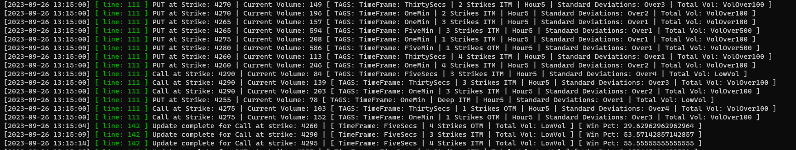

# Option Scanner Application

## Intent of Ongoing Project
This application is being constructed with the purpose to track unusual options activity within the stock market. While being created 
specificially to track SPX options activity, the application is being created with the flexibility to test this strategy on other 
stock options. In the past, I have noticed large spikes of volume on certain SPX contracts, sometimes 4-5 standard deviations from the 
volume seen throughout the day, coupled with little to no movement in contract price as well as underlying price. Many times, shortly 
after, there has been a rapid change in the underlying price in the direction the contract was purchased for. The goal of this 
application is to capture those movements, and determine if there is a potential consistent strategy that can be used here.

## Application Description
The application back-end is being developed with C++, connecting to the Interactive Brokers TWS API. The current functionality is to 
begin by opening data connections to contracts closest to the underlying price (8 calls, 4 in the money, 4 out of the money, 8, puts, etc).
These contracts are then tracked throughout the day, adding more contracts to this window as the underlying price varies. 

The first iteration of the strategy will be this: If the volume of a contract exceeds two standard deviations for the day, and is coupled
with the price delta (high-low) for both the contract and the underlying being less than one standard deviation, this will constitute
an alert. The 5 second, 30 second, 1 minute, and 5 minute time frames will all be monitored simultaneously for each contract.

### Current Status
The base application will track an alert any time an unusual volume has been notified. The alert will then be assigned several tags, which 
can be seen in the enums.h file. Currently, the time window is set to track alerts for 30 minutes. After 30 minutes, the percent gain will 
be calculated for the option that has been alerted, if any, and added to a map containing each of the tags. This way, the app can track
the success probability for both the specific alert, as well as each of the tags individually. The basic state of the application is now
complete. We can monitor the SPX options chain throughout the day, see alerts as the come in (currently via the terminal) as well as
determine their level of success after 30 minutes. Future updates will include an SQL database with API capabilities for a future web 
applicaiton.

## Technologies Used
* C++
* TWS API (Interactive Brokers)
* TwsApiCpp library by JanBoonen (https://github.com/JanBoonen/TwsApiCpp)

## Progress Updates

* Very raw form of alerts has been completed, outputting to terminal. All we are doing here is checking for volume above normal 
	standard deviations for each timeframe. 

## Author
Kale Evans